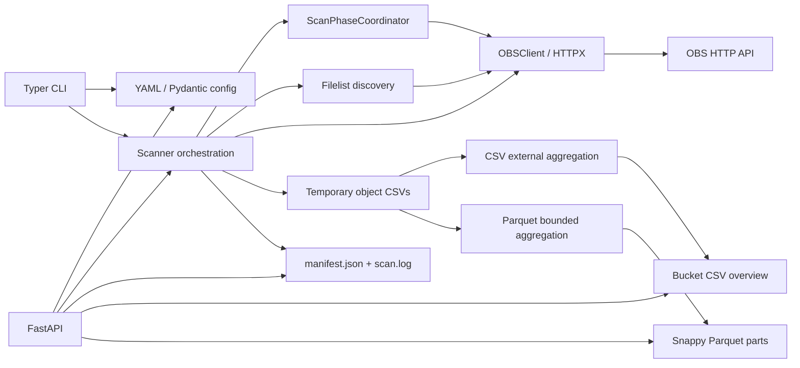

# OBS Scan Platform 项目说明

本文档面向两类读者：负责配置、运行和排障的使用者与运维人员，以及负责维护、测试和扩展代码的开发人员。它独立于仓库中的 README，包含从安装到架构、从 YAML 配置到输出语义的完整说明。

本文描述的是当前代码已经实现的能力。命令示例默认在仓库根目录执行；示例中的域名、应用 ID、桶名和 token 均为占位值，不能直接用于生产环境。

## 1. 项目定位与适用场景

OBS Scan Platform 是一个 Python 扫描程序，用于通过现有 OBS HTTP 接口枚举应用所属的桶、发现桶内对象、拉取对象大小和修改时间，并为每个桶生成 CSV 或 Apache Parquet 目录总览。一次扫描还会生成运行日志和结构化 Manifest，便于审计、下载、告警和后续数据分析。

适合的场景包括：

- 定期盘点多个应用下的自有桶或共享桶；
- 按目录统计对象数量、容量、最大文件和最近修改时间；
- 通过 CSV 阈值字段识别大目录、大文件、空文件和长期未修改目录；
- 生成适合列式分析的 Snappy Parquet 分片；
- 通过 CLI 手工执行，或通过轻量 FastAPI 接口触发和读取结果；
- 在对象数量较大时，以临时 CSV、分块汇总和有界多路归并控制聚合内存。

本项目不是对象存储服务本身，也不包含任务调度器、数据库、Web 控制台、分布式锁或内置身份认证。它依赖上游 OBS 接口，并把结果保存到本地文件系统。

## 2. 阅读导航

| 角色 | 建议阅读顺序 | 重点 |
| --- | --- | --- |
| 使用者/运维 | 1 → 3 → 5 → 6 → 7/8 → 12 → 13 | 安装、配置、运行、取数和排障 |
| 开发/维护 | 1 → 3 → 4 → 9 → 10 → 11 → 14 → 15 | 数据流、模块边界、聚合语义、测试和限制 |

若只想尽快完成一次扫描，可直接阅读第 5、6、7 节。若要消费 Parquet 数据，必须同时阅读第 11 节，特别是 `aggregation_depth` 与输出列 `max_depth` 的区别。

## 3. 当前支持的核心功能

- 从全局或应用级 endpoint 扫描一个或多个已启用应用；
- 调用 `listbuckets` 获取桶，并按所有权、共享桶开关和精确桶名配置筛选；
- 获取每个桶的数据 endpoint；
- 使用有深度和任务数上限的逐层 `filelist` 发现目录、前缀和需要单独取 metadata 的文件；
- 并发拉取对象 metadata，并按前缀分页拉取 objectkeys；
- 在单次运行范围内限制桶并发、HTTP 请求尝试并发和桶内 worker 数；
- 请求失败时按规则重试，并记录结构化失败明细；
- 在请求与同步聚合之间使用写者优先的全局阶段协调，确保同一运行内聚合串行；
- 生成传统 CSV 总览，保持“直接目录并向所有祖先目录累计”的既有规则；
- 默认生成 Parquet 总览，使用 Snappy 压缩，单文件最多 50,000 行；
- Parquet 按一个对象只归入一个目录的规则聚合，并支持 `aggregation_depth` 截断；
- 使用可配置文件扩展名映射生成 Parquet `file_types` JSON array；
- 输出 `manifest.json`、`scan.log`、总览文件，并可选择保留临时对象 CSV 和聚合中间文件；
- 提供 CLI 扫描入口和 FastAPI 健康检查、触发、运行查询、日志及结果下载接口；
- 对 API 路径段进行穿越防护，并对 Parquet 下载执行 Manifest 成员校验和符号链接检查。

## 4. 技术栈

下表中的版本均为项目声明的最低依赖版本，不是某台机器偶然安装的具体版本。

| 技术 | 版本要求或依赖 | 项目中的职责 |
| --- | --- | --- |
| Python | `>=3.11` | 异步扫描、类型模型、文件处理和应用运行时 |
| FastAPI | `>=0.111` | HTTP 查询、触发和文件下载 API |
| Uvicorn | `>=0.30` | ASGI 服务进程 |
| HTTPX | `>=0.27` | 异步调用 OBS HTTP API、连接池和超时 |
| Pydantic | `>=2.7` | YAML 配置模型、默认值、迁移和字段校验 |
| PyYAML | `>=6.0` | 读取 YAML |
| Typer | `>=0.12` | `obs-scan` CLI |
| tqdm | `>=4.66` | CLI 扫描进度条 |
| PyArrow | `>=16.0` | 构造固定 schema 并写入 Snappy Parquet |
| pytest | `>=8.2` | 开发测试 |
| pytest-asyncio | `>=0.23` | 异步扫描和客户端测试 |

项目使用 `setuptools` 构建，源码采用 `src/` 布局，包名为 `obs_scan_platform`，控制台入口为 `obs-scan = obs_scan_platform.cli:main`。

## 5. 快速开始

### 5.1 环境准备

要求 Python 3.11 或更高版本。Windows PowerShell：

```powershell
python -m venv .venv
.\.venv\Scripts\Activate.ps1
python -m pip install -e ".[dev]"
Copy-Item config\apps.example.yaml config\apps.yaml
```

Linux/macOS shell：

```bash
python3 -m venv .venv
source .venv/bin/activate
python -m pip install -e '.[dev]'
cp config/apps.example.yaml config/apps.yaml
```

编辑 `config/apps.yaml`，至少填写可访问的 `endpoint`、非空 `appid` 和有效 `apptoken`。不要把含真实 token 的配置提交到 Git。

### 5.2 运行 CLI 扫描

```powershell
obs-scan scan --config config/apps.yaml
```

默认运行 ID 使用扫描开始时的 UTC 时间，格式为 `YYYYMMDDTHHMMSSZ`。扫描完成后，CLI 输出类似：

```text
scan finished: success run_id=20260730T030405Z
```

`success` 时进程退出码为 0；`partial_failed` 或 `failed` 时退出码为 1。无论退出码如何，都应检查对应运行目录中的 `manifest.json` 和 `scan.log`。

### 5.3 启动 API

Windows PowerShell：

```powershell
$env:OBS_SCAN_CONFIG = "config/apps.yaml"
uvicorn obs_scan_platform.api:app --host 0.0.0.0 --port 8000 --workers 1
```

Linux/macOS shell：

```bash
export OBS_SCAN_CONFIG=config/apps.yaml
uvicorn obs_scan_platform.api:app --host 0.0.0.0 --port 8000 --workers 1
```

标准应用的结果读取根目录固定为当前工作目录下的 `results`，因此通过上述全局 `app` 启动 API 时，建议保持 `scan.results_dir: results`。若代码内调用 `create_app(config_path=..., results_dir=...)`，则可以显式指定其他读取目录。

先验证服务：

```powershell
Invoke-RestMethod http://127.0.0.1:8000/health
```

预期返回 `{"status":"ok"}`。

## 6. 完整 YAML 配置说明

### 6.1 可直接修改的完整示例

下面列出当前 `ScanSettings` 的全部字段、完整内置文件类型映射、全部全局阈值、应用字段和桶级覆盖。所有地址和凭据都是无效占位值。

```yaml
endpoint: https://obs-gateway.example.invalid

scan:
  results_dir: results
  temp_subdir: _tmp
  keep_temp_files: false
  overview_format: parquet
  aggregation_depth: 4
  file_type_map:
    jpg: 图片
    jpeg: 图片
    png: 图片
    gif: 图片
    cr3: RAW
    nef: RAW
    braw: RAW
    mp4: 视频
    mov: 视频
    avi: 视频
    py: 脚本
    sh: 脚本
    js: 脚本
    ts: 脚本
    onnx: 模型
    ckpt: 模型
    safetensors: 模型
    pt: 模型
    parquet: Parquet
    json: 配置文件
    yaml: 配置文件
    yml: 配置文件
    md: 文档
    pdf: 文档
    zip: 压缩包
    tar: 压缩包
  page_size: 1000
  bucket_concurrency: 4
  global_request_concurrency: 150
  per_bucket_prefix_concurrency: null
  objectkeys_concurrency_per_bucket: null
  metadata_concurrency_per_bucket: 8
  request_timeout_seconds: 30
  keepalive_expiry_seconds: 5.0
  max_retries: 3
  retry_base_delay_seconds: 2
  retry_max_delay_seconds: 60
  filelist_task_limit_per_bucket: 100
  metadata_task_limit_per_bucket: 10000
  aggregation_max_directories_in_memory: 100000

defaults:
  large_directory_bytes: 107374182400
  large_file_bytes: 10737418240
  inactive_directory_days: 180
  filelist_depth: 5

applications:
  - appid: com.example.media
    name: 示例媒体应用
    endpoint: https://app-gateway.example.invalid
    apptoken: replace-with-real-token
    enabled: true
    scan_shared_buckets: false
    buckets:
      media-hot:
        enable: true
        large_directory_bytes: 214748364800
        large_file_bytes: 21474836480
        inactive_directory_days: 365
        filelist_depth: 8
      media-skip:
        enable: false
```

### 6.2 顶层字段

| 字段 | 类型/默认值 | 说明 |
| --- | --- | --- |
| `endpoint` | `string/null`，默认空字符串 | 全局 OBS 管理接口基地址；应用 endpoint 为空时继承它 |
| `scan` | object，默认全部使用模型默认值 | 扫描、并发、重试、临时目录和总览格式 |
| `defaults` | object，默认见下表 | 所有桶的默认阈值和 filelist 深度 |
| `applications` | array，默认空 | 应用列表 |

### 6.3 `scan` 字段

| 字段 | 默认值 | 说明 |
| --- | --- | --- |
| `results_dir` | `results` | 结果根目录；相对路径基于进程当前工作目录 |
| `temp_subdir` | `_tmp` | 每次运行目录内的临时子目录名 |
| `keep_temp_files` | `false` | 是否保留对象 CSV 和聚合中间文件；保留时 Manifest 写入 `temp_dir` |
| `overview_format` | `parquet` | 全局总览格式，只能是 `csv` 或 `parquet` |
| `aggregation_depth` | `4` | Parquet 输出路径的最大归属层级，必须 `>= 0`；不改变 CSV 语义 |
| `file_type_map` | 内置完整映射 | Parquet 扩展名到类型的映射；自定义项与内置映射合并 |
| `page_size` | `1000` | filelist 请求每页大小 |
| `bucket_concurrency` | `4` | 单次运行中所有应用共享的桶生命周期并发上限 |
| `global_request_concurrency` | `150` | 单次运行所有应用和桶共享的 HTTP 请求尝试上限；运行时必须至少为 1 |
| `per_bucket_prefix_concurrency` | `null` | 旧 objectkeys worker 配置名；仅在新名称为空时生效 |
| `objectkeys_concurrency_per_bucket` | `null` | 每桶 objectkeys prefix worker 上限；为空时回退到旧名称，再回退到有效默认 30 |
| `metadata_concurrency_per_bucket` | `8` | 每桶 metadata worker 上限 |
| `request_timeout_seconds` | `30` | HTTPX 请求超时秒数 |
| `keepalive_expiry_seconds` | `5.0` | HTTP keep-alive 过期秒数，必须大于 0 |
| `max_retries` | `3` | 首次请求之外的最大重试次数；总尝试次数为 `max_retries + 1` |
| `retry_base_delay_seconds` | `2` | 指数退避初始秒数 |
| `retry_max_delay_seconds` | `60` | 单次退避上限秒数 |
| `filelist_task_limit_per_bucket` | `100` | 每桶 filelist 发现任务总量软上限；扫描器至少按 1 使用 |
| `metadata_task_limit_per_bucket` | `10000` | 某一层发现的 metadata 任务超限时回滚该层并改用较高层前缀；扫描器至少按 1 使用 |
| `aggregation_max_directories_in_memory` | `100000` | 聚合一个分块时最多保留的不同目录数，必须至少为 1 |

除表中明确写出的 Pydantic 范围约束外，多个整数配置只进行类型转换，扫描器仅对部分 worker 或任务上限使用 `max(1, value)`。生产配置应让页大小、桶并发、worker 数、超时、阈值和任务上限保持非负或正数；特别是 `bucket_concurrency` 不应设为 0。

objectkeys 并发优先级为：`objectkeys_concurrency_per_bucket` → `per_bucket_prefix_concurrency` → 30。新配置应使用 `objectkeys_concurrency_per_bucket`；旧名称当前仍属于模型字段，并非 `aggregation_depth` 的兼容别名。

### 6.4 `defaults` 与桶级覆盖

| 字段 | 全局默认值 | 桶级是否可覆盖 | 说明 |
| --- | ---: | --- | --- |
| `large_directory_bytes` | `107374182400`（100 GiB） | 是 | CSV 中判定大目录的字节阈值 |
| `large_file_bytes` | `10737418240`（10 GiB） | 是 | CSV 中计数大文件的字节阈值 |
| `inactive_directory_days` | `180` | 是 | CSV 中判定不活跃目录的天数阈值 |
| `filelist_depth` | `5` | 是 | filelist 逐层发现的最大深度，扫描器至少按 1 使用 |

桶覆盖字段通过应用下的 `buckets` 字典配置。字典键必须与 OBS 返回的桶名称完全一致；未命中时全部使用全局 `defaults`。覆盖对象中的空值不覆盖默认值，`enable: false` 会跳过该桶。

### 6.5 应用字段

| 字段 | 默认值 | 说明 |
| --- | --- | --- |
| `appid` | 空字符串 | 应用 ID；扫描时必填 |
| `name` | 空字符串 | 人类可读名称，写入应用级 Manifest |
| `endpoint` | 空字符串 | 应用级管理接口；非空时优先于全局 endpoint |
| `apptoken` | 空字符串 | OBS 应用 token；扫描时必填 |
| `enabled` | `true` | 为 `false` 时整个应用不参与扫描 |
| `scan_shared_buckets` | `false` | 为 `false` 时仅扫描 `auth == owner` 且 `shareFrom` 为空的桶；为 `true` 时也允许满足必需桶字段的共享桶 |
| `buckets` | 空字典 | 按精确桶名配置 enable 和阈值覆盖 |

应用 endpoint 为空或只含空白时继承全局 endpoint。扫描应用前会检查最终 endpoint、`appid` 和 `apptoken`；缺失时该应用标记为 `failed`，其他应用仍可继续。

### 6.6 深度名称兼容规则

新配置必须使用 `scan.aggregation_depth`。为兼容旧 YAML，若原始 `scan` 中只出现 `max_depth`，加载时会迁移为 `aggregation_depth`；模型序列化和 `GET /config/apps` 只输出规范名称。

若同一份 YAML 同时出现 `aggregation_depth` 和旧 `max_depth`，即使两个值相同也会直接报错：

```text
aggregation_depth and max_depth cannot both be configured
```

注意，Parquet schema 中仍有一个名为 `max_depth` 的输出列。配置 `aggregation_depth` 控制路径截断，输出 `max_depth` 表示该行统计到的最深原始文件目录层级，两者含义不同。

### 6.7 文件类型映射合并规则

`file_type_map` 的扩展名会去除首个点、转为小写并去除两侧空白，分类值也会去除两侧空白；空 key 或空分类会报错。配置只需写要覆盖或新增的项，未写项仍保留内置映射。例如：

```yaml
scan:
  file_type_map:
    .jpg: 照片
    log: 日志
```

这会把 `jpg` 改为“照片”、新增 `log`，其他内置项不变。无扩展名或未命中的扩展名统一归为“其他”。

## 7. CLI 使用说明

安装项目后使用 `obs-scan`，不是 `python -m obs_scan_platform.cli`。查看帮助：

```powershell
obs-scan --help
obs-scan scan --help
```

`scan` 命令选项如下：

| 选项 | 是否必需 | 说明 |
| --- | --- | --- |
| `--config PATH` / `-c PATH` | 是 | YAML 配置路径 |
| `--appid TEXT` | 否 | 只保留精确匹配的已启用应用 ID |
| `--run-id TEXT` | 否 | 使用指定运行 ID，而不是 UTC 时间生成值 |

常用命令：

```powershell
# 扫描全部已启用应用
obs-scan scan --config config/apps.yaml

# 只扫描一个应用
obs-scan scan --config config/apps.yaml --appid com.example.media

# 指定可复现的运行目录名
obs-scan scan --config config/apps.yaml --run-id manual-20260730
```

CLI 会显示 filelist 和 objectkeys 进度。`--appid` 若没有命中任何已启用应用，当前实现会产生一个应用列表为空但状态为 `success` 的 Manifest，因此自动化脚本还应检查 `applications` 数量。`--run-id` 当前不做路径规范化，只应使用字母、数字、点、下划线或连字符组成的单个安全目录名；不要传入 `/`、`\`、`.` 或 `..` 路径片段。

## 8. API 使用说明

### 8.1 路由

| 方法 | 路径 | 用途 | 成功响应 |
| --- | --- | --- | --- |
| `GET` | `/health` | 健康检查 | `{"status":"ok"}` |
| `GET` | `/config/apps` | 返回已加载配置，所有应用 `apptoken` 替换为 `******` | JSON object |
| `GET` | `/runs` | 按目录名排序返回含 `manifest.json` 的运行列表 | JSON array |
| `GET` | `/runs/{run_id}` | 返回一个运行的 Manifest | JSON object |
| `GET` | `/runs/{run_id}/logs` | 返回 UTF-8 `scan.log` | `text/plain` |
| `GET` | `/runs/{run_id}/apps/{appid}/buckets/{bucket_name}/csv` | 下载 CSV 总览 | `text/csv` |
| `GET` | `/runs/{run_id}/apps/{appid}/buckets/{bucket_name}/parquet/{part_name}` | 下载 Manifest 声明的 Parquet 分片 | `application/vnd.apache.parquet` |
| `POST` | `/runs` | 在同一进程的 BackgroundTask 中触发一次全量扫描 | HTTP 202，`{"status":"accepted"}` |

`POST /runs` 不接收请求体，也不返回运行 ID；扫描器自行生成 UTC 运行 ID。可稍后查询 `/runs` 获取已完成运行。Manifest 只在整次扫描结束时写入，因此执行中的扫描不会以“进行中 Manifest”出现。

### 8.2 调用示例

PowerShell：

```powershell
$base = "http://127.0.0.1:8000"

Invoke-RestMethod "$base/health"
Invoke-RestMethod "$base/config/apps"
Invoke-RestMethod -Method Post "$base/runs"
Invoke-RestMethod "$base/runs"
Invoke-RestMethod "$base/runs/manual-20260730"
Invoke-WebRequest "$base/runs/manual-20260730/logs" -OutFile scan.log
Invoke-WebRequest "$base/runs/manual-20260730/apps/com.example.media/buckets/media-hot/parquet/part-00001.parquet" -OutFile part-00001.parquet
```

curl：

```bash
curl http://127.0.0.1:8000/health
curl -X POST http://127.0.0.1:8000/runs
curl http://127.0.0.1:8000/runs
curl -o bucket.csv http://127.0.0.1:8000/runs/manual-20260730/apps/com.example.media/buckets/media-hot/csv
```

### 8.3 状态码与运行约束

- `202`：扫描已接受，但不表示扫描成功；最终结果以 Manifest 为准。
- `409`：当前 API 进程的 `active_scan` 已为 true。
- `404`：常见于未配置 `OBS_SCAN_CONFIG`、运行或日志不存在、请求的格式与 Manifest 不符、Parquet part 名不满足 `part-00000.parquet` 模式、part 不在 Manifest，或路径段不安全。
- active scan 标志只存在于当前 Python 进程。必须使用 `--workers 1` 才能让冲突保护可靠；多个 Uvicorn worker 会各自允许一次扫描。
- API 没有内置认证或授权。不要直接暴露到不可信网络，应放在受控网络或带认证的反向代理之后。

Parquet 下载使用 Manifest 中 `overview_files` 的精确成员列表，并拒绝不匹配的 part 名、目录逃逸和符号链接 part。下载客户端应先读取 Manifest，而不是猜测分片数量。

## 9. 扫描流程与并发模型

一次扫描的主要时序如下：

```mermaid
sequenceDiagram
    actor Caller as CLI/API
    participant Scanner
    participant Client as OBSClient
    participant Gate as ScanPhaseCoordinator
    participant OBS as OBS HTTP API
    participant Temp as Temporary CSV
    participant Agg as CSV/Parquet Aggregator
    participant Result as Result Directory

    Caller->>Scanner: start run(config, appid, run_id)
    Scanner->>Scanner: validate endpoint/appid/apptoken
    Scanner->>Client: listbuckets
    Client->>Gate: enter request attempt
    Gate->>OBS: GET listbuckets
    OBS-->>Gate: JSON response
    Gate-->>Client: leave request attempt
    loop each admitted bucket under run-global bucket limit
        Scanner->>Client: resolve bucket endpoint
        Client->>Gate: enter request attempt
        Gate->>OBS: GET bucket endpoint
        OBS-->>Client: bucket data endpoint
        loop bounded breadth-first filelist levels
            Scanner->>Client: filelist pages
            Client->>Gate: request attempt/retry
            Gate->>OBS: GET filelist
            OBS-->>Client: folders and direct files
        end
        par metadata workers
            Scanner->>Client: object metadata
            Client->>Gate: enter request attempt
            Gate->>OBS: GET metadata
            OBS-->>Client: object size and modified time
        and objectkeys prefix workers
            Scanner->>Client: paged objectkeys
            Client->>Gate: enter request attempt
            Gate->>OBS: GET objectkeys
            OBS-->>Client: object page
        end
        Scanner->>Temp: append object rows
        Scanner->>Gate: wait for aggregation writer
        Note over Gate: stop admitting new attempts; drain active attempts
        Gate-->>Scanner: exclusive aggregation slot
        Scanner->>Agg: synchronous bounded merge
        Agg->>Result: atomic CSV replace or Parquet directory publication
        Scanner->>Gate: release aggregation slot
        Scanner->>Temp: cleanup unless keep_temp_files
    end
    Scanner->>Result: write final manifest.json and scan.log
    Scanner-->>Caller: success/partial_failed/failed
```

### 9.1 发现与采集

1. 应用级校验完成后调用 `/rest/s3/listbuckets`。
2. 桶必须包含非空 ID、名称、vendor 和 region，并通过自有/共享及桶配置筛选。
3. 调用 `/rest/s3/bucket/endpoint` 获取该桶的数据接口地址。
4. `FilelistDiscoveryScheduler` 从 `/` 开始逐层扫描 `/rest/s3/bucket/filelist`。同一层完成后才进入下一层，深度由 `filelist_depth` 控制，总任务受 `filelist_task_limit_per_bucket` 控制。
5. 若当前层产生的 metadata 文件数超过 `metadata_task_limit_per_bucket`，调度器回滚该层发现，保留较高层前缀交给 objectkeys 扫描。
6. 不属于已发现前缀的直接文件通过 `/rest/boto3/s3/object/metadata` 获取；前缀通过 `/rest/boto3/s3/list/bucket/objectkeys` 分页获取。
7. 合法对象记录被追加到桶临时目录中的 CSV，字段为 `object_key,size_bytes,last_modified_ms`。

### 9.2 并发层级

- 所有已启用应用并发启动。
- `bucket_concurrency` 是一次 `Scanner.run` 全局共享的 semaphore，覆盖桶从请求开始、聚合到临时清理的完整生命周期，而不是每个应用各自一份。
- `global_request_concurrency` 限制本次运行所有应用、所有桶的 HTTP 请求尝试。每个应用有独立 HTTPX client，但共享同一个 `ScanPhaseCoordinator`。
- 每个应用的 HTTPX client 固定使用 `max_connections=100`、`max_keepalive_connections=20`，keep-alive 时长由配置控制；因此全局请求上限是外层准入上限，不保证存在同等数量的同时活动 socket。
- metadata 每桶最多使用 `metadata_concurrency_per_bucket` 个 worker。
- objectkeys 每桶使用前述新/旧配置优先级确定 worker 数。
- filelist 同一层的目录任务并发提交，但仍受全局请求并发约束。

### 9.3 请求与聚合阶段屏障

当任一桶准备聚合时，它作为等待中的 writer：

1. 后续请求尝试和重试不再进入；
2. 已进入的 HTTP 请求尝试可以完成发送、读取、JSON 校验和退出；
3. 活跃请求尝试归零后，只允许一个桶执行同步聚合；
4. 多个等待聚合按互斥方式串行完成；
5. 没有等待或活动聚合后，请求尝试恢复。

指数退避 sleep 位于 request-attempt 临界区之外，因此不会把等待时间算作活跃 HTTP 尝试；重试再次发起时仍需通过屏障。协调只在一次 `Scanner.run`、一个 Python 进程和一个事件循环内有效，不提供跨进程或跨主机协调。

聚合实现是同步文件和 PyArrow 工作，运行在事件循环线程中。它被明确串行化，适合控制峰值资源，但也意味着大型桶聚合期间不会并行推进其他异步业务代码。

## 10. 系统架构与模块职责

### 10.1 组件关系



### 10.2 源码模块

| 模块 | 职责 |
| --- | --- |
| [`__init__.py`](../src/obs_scan_platform/__init__.py) | Python 包标记 |
| [`config.py`](../src/obs_scan_platform/config.py) | Pydantic 配置模型、默认文件类型、endpoint 继承、桶阈值合并、旧深度名迁移和 token 掩码 |
| [`cli.py`](../src/obs_scan_platform/cli.py) | Typer 入口、参数解析、进度模式和退出码 |
| [`api.py`](../src/obs_scan_platform/api.py) | FastAPI 路由、进程内扫描触发、Manifest/日志/结果下载和路径安全检查 |
| [`scanner.py`](../src/obs_scan_platform/scanner.py) | 应用和桶编排、发现、metadata/objectkeys 采集、状态汇总、聚合调用、清理和 Manifest |
| [`obs_client.py`](../src/obs_scan_platform/obs_client.py) | HTTP 请求、JSON/业务错误识别、响应体截断、重试和退避 |
| [`scan_coordination.py`](../src/obs_scan_platform/scan_coordination.py) | 全局请求 semaphore 与写者优先的请求/聚合阶段协调 |
| [`filelist_discovery.py`](../src/obs_scan_platform/filelist_discovery.py) | 逐层 filelist 任务、前缀/直接文件去交叉、深度/任务限制和超限回滚 |
| [`csv_store.py`](../src/obs_scan_platform/csv_store.py) | 临时对象 CSV 的追加写和严格表头读取 |
| [`aggregation.py`](../src/obs_scan_platform/aggregation.py) | 传统 CSV 总览入口、阈值派生字段和原子替换 |
| [`external_aggregation.py`](../src/obs_scan_platform/external_aggregation.py) | CSV 目录统计、分块排序、有界 fan-in 归并和中间文件管理 |
| [`parquet_aggregation.py`](../src/obs_scan_platform/parquet_aggregation.py) | Parquet 归属规则、schema、文件类型/日期/深度聚合、分片和原子目录发布 |
| [`models.py`](../src/obs_scan_platform/models.py) | 桶、对象、状态、进度、部分失败、请求错误和桶结果数据结构 |
| [`paths.py`](../src/obs_scan_platform/paths.py) | 对象 key 规范化、CSV 祖先目录链、目录深度和安全临时文件名 |
| [`logging_config.py`](../src/obs_scan_platform/logging_config.py) | stdout/文件日志配置，并抑制 HTTPX/HTTPCore 的低级请求日志 |

仓库根目录的 [`pyproject.toml`](../pyproject.toml) 声明依赖和 CLI 入口；[`config/apps.example.yaml`](../config/apps.example.yaml) 是简化的配置样例；[`tests`](../tests) 是行为契约的主要回归保护。

## 11. CSV 与 Parquet 聚合规则

两种格式共享同一批临时对象行，但目录归属和输出 schema 不相同，不能只通过文件后缀互换消费逻辑。

### 11.1 CSV 总览

CSV 保持历史规则。对象 `/a/b/file.txt` 同时累计到 `/a/b/`、`/a/` 和 `/`。因此父目录指标包含所有后代，并非只统计直接文件。

最终 CSV 固定包含 17 个字段：

| 字段 | 说明 |
| --- | --- |
| `run_id` | 本次运行 ID |
| `appid` | 应用 ID |
| `bucket_name` | 桶名 |
| `bucket_id` | 桶 ID |
| `directory_path` | 当前汇总目录，根目录为 `/` |
| `depth` | `directory_path` 自身层级，根目录为 0 |
| `object_count` | 直接文件和所有后代文件的累计数量 |
| `total_size_bytes` | 累计字节数 |
| `max_file_size_bytes` | 累计范围内最大文件字节数 |
| `empty_file_count` | 大小为 0 的文件数 |
| `large_file_count` | 大小 `>= large_file_bytes` 的文件数 |
| `latest_modified_ms` | 最大有效修改时间，Unix 毫秒；全部缺失时为空 |
| `inactive_days` | `max(0, (scan_started_ms - latest_modified_ms) // 86400000)`；时间缺失时为空 |
| `is_large_directory` | `total_size_bytes >= large_directory_bytes`，小写 `true/false` |
| `has_large_file` | `large_file_count > 0`，小写 `true/false` |
| `has_empty_file` | `empty_file_count > 0`，小写 `true/false` |
| `is_inactive_directory` | `inactive_days >= inactive_directory_days`，小写 `true/false` |

每个临时对象 CSV 先在 `aggregation_max_directories_in_memory` 限制下分块排序，再以 fan-in 32 逐轮合并，最后用 `.tmp` 文件原子替换目标 CSV。来自多个临时源的相同对象行不会去重，会按出现次数重复累计。

### 11.2 Parquet schema

Parquet 固定使用以下 10 个 non-null 字段：

| 顺序 | 字段 | Arrow 类型 | 说明 |
| ---: | --- | --- | --- |
| 1 | `bucket_id` | `string` | 桶 ID |
| 2 | `bucket_name` | `string` | 桶名 |
| 3 | `appid` | `string` | 应用 ID |
| 4 | `path` | `string` | 该行唯一归属目录，根目录为 `/`，非根目录以 `/` 包围 |
| 5 | `object_count` | `int64` | 归入该行的文件数 |
| 6 | `total_size` | `int64` | 文件总大小，单位字节 |
| 7 | `max_file_size` | `int64` | 最大文件大小，单位字节 |
| 8 | `last_modified` | `string` | UTC 日期，格式 `YYYY-MM-DD` |
| 9 | `max_depth` | `int32` | 本行统计到的最深原始文件所在目录层级 |
| 10 | `file_types` | `string` | 去重、排序后的分类 JSON array 字符串 |

写入规则：

- 文件格式为 Apache Parquet，压缩算法为 Snappy。
- 每个 part 最多 50,000 行，按路径排序后的结果依次写为 `part-00001.parquet`、`part-00002.parquet`……。
- 空桶仍生成 `part-00001.parquet`，0 行但保留完整强类型 schema。
- 每个对象只归入一个 `path`，不向更浅父目录重复累计。
- 多个临时源中的相同对象行不去重，会重复计数和计入容量。
- `file_types` 存储分类名称而不是扩展名，例如 `file.jpg` 和 `cover.png` 都贡献“图片”，最终可能为 `["RAW","图片"]`。

### 11.3 `aggregation_depth`、`path` 与 `max_depth`

文件深度只计算其所在目录，不包含文件名：

- `/a/b/file.txt` 的文件深度是 2；
- `/a/b/c/d/e/file.txt` 的文件深度是 5；
- `/file.txt` 的文件深度是 0。

当 `aggregation_depth: 4`：

| 对象 | 输出 `path` | 输出 `max_depth` | 解释 |
| --- | --- | ---: | --- |
| `/a/b/file.txt` | `/a/b/` | 2 | 未达到截断层，只统计 `/a/b/` 直接文件 |
| `/a/b/c/d/file.txt` | `/a/b/c/d/` | 4 | 恰好位于截断层 |
| `/a/b/c/d/e/file.txt` | `/a/b/c/d/` | 5 | 更深文件向第 4 层归并，但保留原始最深层级 |
| `/a/b/c/d/e/f/file.bin` | `/a/b/c/d/` | 6 | 与上一行合并后，该 path 的 `max_depth` 取 6 |

小于截断层的目录只统计当前目录下的文件，不累计子目录；达到截断层的 `path` 汇总所有共享该前四层前缀的更深文件。`aggregation_depth: 0` 会把所有对象归入 `/`，但 `max_depth` 仍报告其中最深文件目录层级。

### 11.4 `last_modified` 聚合

每个 Parquet `path` 取其所有归属文件中最大的有效 `last_modified_ms`，按 UTC 转为日期字符串。缺失或无法转换的时间不参与最大值比较：

- 至少一个文件有有效时间：使用所有有效时间中的最新日期；
- 所有文件都缺失或时间无效：使用本次扫描开始日期的 UTC 日期；
- 第 `aggregation_depth` 层汇总更深对象时，时间与数量、大小、类型和最大深度一起逐级合并。

Parquet 内部同样采用不同目录数量上限、分块排序和有界多路归并。最终先写隐藏 staging 目录，再替换桶输出目录；若替换失败，会尝试恢复原目录并清理 staging，避免发布半套分片。

## 12. 结果目录、Manifest、日志与临时文件

### 12.1 目录结构

CSV 模式：

```text
results/
└── <run_id>/
    ├── manifest.json
    ├── scan.log
    ├── <appid>/
    │   ├── <bucket-a>.csv
    │   └── <bucket-b>.csv
    └── _tmp/
        └── <appid>/<bucket>/...   # keep_temp_files=true 时保留
```

Parquet 模式：

```text
results/
└── <run_id>/
    ├── manifest.json
    ├── scan.log
    ├── <appid>/
    │   └── <bucket>/
    │       ├── part-00001.parquet
    │       ├── part-00002.parquet
    │       └── ...
    └── _tmp/
        └── <appid>/<bucket>/
            ├── metadata_files.csv
            ├── <safe-prefix>_<sha1>.csv
            └── _aggregation/...   # keep_temp_files=true 时保留
```

项目不会额外保存一份最终、去重后的完整对象明细。临时 CSV 是采集和聚合输入；`keep_temp_files: false` 时，每个桶完成后尝试删除其临时目录。

### 12.2 Manifest

顶层字段包括：

- `run_id`、`status`、`started_ms`、`ended_ms`；
- 实际配置文件路径 `config_path`；
- `applications` 数组。

应用条目包含 `appid`、`name`、`status`、可选 `error` 和 `buckets`。桶条目包含：

- 桶身份和状态：`bucket_name`、`bucket_id`、`status`；
- 输出：兼容字段 `csv_path`、`overview_format`、`overview_path`、`overview_files`；
- 当前生效阈值 `thresholds`；
- `error`、完整 `errors` 和有部分错误时的 `partial_errors`；
- 毫秒/ISO UTC 起止时间及 `elapsed_seconds`、`request_elapsed_seconds`、`processing_elapsed_seconds`；
- `keep_temp_files: true` 时的 `temp_dir`。

Manifest 在所有应用扫描结束后一次性写入，不是持续更新的运行状态文件。消费方应以桶 `overview_format` 和 `overview_files` 为准：CSV 通常有一个文件，Parquet 可能有多个 part。

### 12.3 日志和清理

`scan.log` 与控制台都使用 INFO 级别，记录应用/桶开始结束、filelist/metadata/objectkeys 进度、请求失败、聚合进度和清理错误。HTTPX/HTTPCore 的低级 INFO 请求日志被过滤，但 OBSClient 自己的失败尝试日志仍保留诊断数据。

若 `keep_temp_files: false` 且清理失败，桶状态会被改为 `failed`，错误中追加经过 URL 清理的 `cleanup failed` 信息。若需要调查对象行或中间归并，应在复现前设置 `keep_temp_files: true`，并确保结果磁盘空间充足。

## 13. 失败语义、安全机制与故障排查

### 13.1 状态与重试

状态有 `pending`、`running`、`success`、`failed` 和 `partial_failed`；最终 Manifest 通常使用后三种。当前扫描流程没有在磁盘 Manifest 中持续写入 `pending/running`。

- `success`：桶总览生成完成，且没有记录 filelist、metadata 或 objectkeys 部分失败。
- `partial_failed`：部分目录、对象或前缀请求失败，但其余数据仍被聚合并发布。总览是不完整数据，不能当成完整盘点。
- `failed`：应用必填配置缺失、关键请求失败、聚合异常、意外异常或临时清理失败等导致桶/应用无法按成功语义完成。

应用和运行状态按子状态汇总：全部成功为 `success`，全部失败为 `failed`，其他组合为 `partial_failed`。空应用列表或应用没有可扫描桶时，当前汇总结果为 `success`，因此运维检查还要验证应用数和桶数。

OBSClient 对网络异常、HTTP 408/429/5xx、无效 JSON 和带失败原因的 OBS 业务失败执行重试；普通 4xx 通常不重试。延迟为 `min(retry_max_delay_seconds, retry_base_delay_seconds * 2^(attempt-1))`。

### 13.2 安全边界

- `GET /config/apps` 将每个 `apptoken` 替换为 `******`。
- API 拒绝 `.`, `..`、含 `/` 或 `\` 的路径段，并确保解析后的文件仍位于结果根目录内。
- `/runs` 忽略符号链接运行目录和符号链接 Manifest；Parquet 下载还要求 part 是 Manifest 成员、普通文件且不是符号链接。
- 部分失败摘要的 reason 和清理错误会把 URL 或 credential-like 查询文本替换为占位符。
- 但请求失败的详细 `errors`、OBSClient 失败日志和最多 2,048 字符的响应体用于诊断，当前可能包含原始 URL、query token、requestbody 或上游返回的敏感内容。`manifest.json` 和 `scan.log` 必须与 YAML/token 一样按敏感数据保护。
- 内置 API 没有认证、TLS、租户隔离或访问控制。应使用文件权限限制结果目录，并在 API 前放置受控网络、TLS 和认证代理。
- CLI 自定义 `run_id`、配置中的 `appid` 和上游桶名会参与输出路径。应使用安全的单段名称，并限制配置和上游元数据的写入来源。

### 13.3 故障排查表

| 现象 | 常见原因 | 检查和处理 |
| --- | --- | --- |
| YAML 解析或 Pydantic 校验失败 | 缩进错误、格式类型错误、同时配置两个深度名、非法 overview 格式、空文件类型映射项 | 用 Python 加载配置；只保留 `aggregation_depth`；检查完整异常路径 |
| 应用立即 `failed` | 最终 endpoint、`appid` 或 `apptoken` 为空 | 检查应用 endpoint 是否继承全局值，检查 token 注入方式 |
| 运行 `success` 但没有应用/桶 | `--appid` 未命中、应用 disabled、桶缺字段、共享桶开关、桶 `enable: false` | 检查 Manifest 中 `applications`/`buckets` 数量和 `scan.log` skipped 记录 |
| 桶 `partial_failed` | 部分 filelist、metadata 或 objectkeys 请求失败 | 查看 `partial_errors` 计数/样本及 `errors`；结果不可视为完整 |
| 请求最终失败 | 网络错误、408/429/5xx、OBS 业务错误或无效 JSON 超过重试次数 | 查看 endpoint、attempts、status 和响应体；核对超时、重试和上游状态 |
| `POST /runs` 返回 409 | 同一 API 进程已有 active scan | 等待当前任务结束；检查进程日志；不要通过增加 worker 绕过保护 |
| 下载返回 404 | 运行/日志不存在、格式路径不匹配、part 不在 Manifest、路径段不安全或 API 读取了不同 results_dir | 先查运行 Manifest，再按 `overview_files` 请求；核对工作目录和 API results_dir |
| 临时目录未删除且桶失败 | 文件占用、权限、杀毒软件或磁盘异常导致 cleanup 失败 | 关闭占用进程，保留证据后手工清理明确的桶临时目录 |
| Parquet part 很多 | 聚合目录行数超过每 part 50,000 | 按 Manifest 顺序读取所有 part；不要只读取第一个 |
| Windows 全量测试有少量失败 | 符号链接权限、CRLF、反斜杠路径语义或 CLI 路径分隔符的已知可移植性差异 | 先核对是否与第 14 节已知基线一致，不要隐藏新的专项失败 |

## 14. 开发、测试与扩展指南

### 14.1 开发环境和常用检查

```powershell
python -m venv .venv
.\.venv\Scripts\Activate.ps1
python -m pip install -e ".[dev]"

pytest -q
python -m compileall -q src tests
git diff --check
```

仓库内也可能存在被 Git 忽略的 `.superpowers/sdd/.venv` 验证环境，但它是本机工作辅助，不属于项目交付物，不应在其他机器上假定存在。

按范围运行测试：

```powershell
pytest tests/test_config.py -q
pytest tests/test_cli.py tests/test_api.py -q
pytest tests/test_obs_client.py tests/test_scan_coordination.py -q
pytest tests/test_scanner.py tests/test_scan_end_to_end.py -q
pytest tests/test_aggregation.py tests/test_external_aggregation.py -q
pytest tests/test_parquet_aggregation.py -q
```

| 测试区域 | 主要契约 |
| --- | --- |
| config | 默认值、endpoint 继承、桶覆盖、文件映射、深度名迁移/冲突 |
| CLI/API | 参数、退出、token 掩码、运行触发、路径安全和下载 |
| OBS client | 编码、响应解析、失败明细、重试与退避 |
| coordination | 全局请求限制、writer preference、请求 drain、聚合串行 |
| scanner/end-to-end | 应用/桶编排、发现、并发、部分失败、Manifest 和清理 |
| CSV aggregation | 祖先累计、阈值、重复行、有界外部归并和原子输出 |
| Parquet aggregation | 固定 schema、归属/深度/日期/类型、分片、压缩和发布 |

截至本文对应代码状态，Windows 全量 suite 存在 5 个已记录的可移植性基线失败：两个符号链接权限场景、CSV 响应 CRLF、反斜杠路径语义和 CLI 路径分隔符。专项修改必须保证相关测试通过；不能把新的失败归入该基线，也不能把全量 suite 标记为绿色。

### 14.2 安全扩展路径

新增或修改配置字段时：

1. 修改 [`config.py`](../src/obs_scan_platform/config.py) 的模型和默认值；
2. 明确旧配置兼容、冲突和序列化规则；
3. 更新 `config/apps.example.yaml`、本说明和配置测试；
4. 检查 `/config/apps` 不会泄露新凭据。

新增 OBS 接口或采集阶段时：

1. 通过 `OBSClient.get_json` 发起请求，确保请求尝试进入 `ScanPhaseCoordinator`；
2. 在 scanner 中定义失败是关键失败还是可继续的部分失败；
3. 避免在日志、reason 或响应模型中新增凭据泄漏；
4. 为分页终止、空响应、重试、取消和并发上限补测试。

修改聚合时：

1. 先把期望 schema 和归属语义写成测试；
2. 保持 `aggregation_max_directories_in_memory` 和 fan-in 有界，避免全桶对象或目录一次性载入内存；
3. 保持 CSV 原子文件替换或 Parquet staging 目录发布；
4. 修改内部 summary 字段时同步更新写、读、合并及异常路径；
5. 检查空桶、重复对象、缺失时间、非法时间、超 50,000 行和多轮归并。

新增 API 下载时，应复用安全路径段和根目录 containment 思路；若结果是分片集合，应像 Parquet 一样以 Manifest 为白名单，而不是只按文件存在性提供下载。

### 14.3 仓库交接规则

每个开发任务结束时，仓库要求更新 [`docs/current-task.md`](current-task.md) 和 [`docs/handoff.md`](handoff.md)，记录分支、状态、改动、验证、风险和下一会话的精确恢复命令。提交前检查 `git status`、完整 diff、无关改动、机器路径和秘密，再提交并推送 feature branch。

## 15. 当前限制与运维建议

### 15.1 当前限制

- 没有内置定时调度、任务队列、数据库、Web UI、告警投递或结果生命周期管理。
- API 没有认证；扫描互斥、请求并发和聚合屏障都是进程内/运行内状态，不跨 Uvicorn worker、进程或主机。
- `POST /runs` 不返回 run ID，Manifest 只在结束时生成；API 不能查询结构化的实时进度。
- 模块级 FastAPI `app` 默认从 `results` 读取，不自动采用 YAML 中自定义的 `scan.results_dir`。
- 聚合为同步并串行执行，超大桶会暂停同进程中其他扫描请求阶段。
- 临时来源中的重复对象不会去重；若上游或发现路径重复返回对象，统计会重复。
- CSV 与 Parquet 的父子目录聚合规则不同，消费者不能假设两者只差存储格式。
- 最终交付只有目录总览；对象级数据只存在于可选保留的临时 CSV，不提供稳定的对象明细 schema 或下载 API。
- 文件路径来自 run ID、appid 和桶名；scanner 写入侧没有与读取 API 完全相同的路径段校验。
- 尚未在本文档任务中连接真实 OBS 环境做生产规模验证；自动化测试使用受控响应覆盖代码边界。
- Windows 测试存在第 14 节所述的 5 个已知可移植性失败。

### 15.2 运维建议

- 使用单个 Uvicorn worker；若需要多实例，必须在外部增加分布式锁或任务队列后再扩容。
- 让 API 监听受控地址，并使用认证反向代理、TLS 和网络访问控制。
- 将配置文件、`manifest.json`、`scan.log` 和 `_tmp` 都按敏感数据设置最小文件权限。
- 保持 `results_dir: results`，或在自定义 API 工厂中显式传入同一结果目录。
- 为每次运行预留原始临时 CSV、聚合中间文件、staging/backup 和最终输出的磁盘空间；排障结束后关闭 `keep_temp_files`。
- 从较保守的并发开始，根据 OBS 限流、429、延迟、CPU、内存和磁盘吞吐逐步调整。
- 自动化判断不要只看 CLI 退出码或顶层状态；同时验证期望应用/桶数量、每桶状态、`partial_errors` 和 `overview_files`。
- Parquet 消费方读取 Manifest 中全部 part，并校验 10 列 schema、Snappy 可读性和每 part 行数。
- 使用只含安全单段字符的 appid、桶名和手工 run ID；不要用用户自由输入直接构造这些值。
- 在代表性 OBS 环境先做小范围扫描，核对 CSV 祖先累计和 Parquet 截断层聚合，再扩大应用和桶范围。
